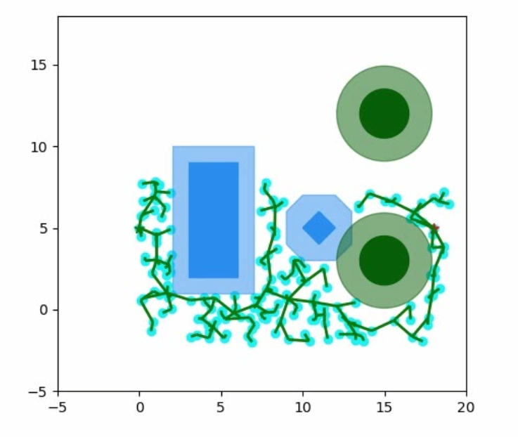

# Robotics-Navigation
Team JSquared - Jaidev Shriram, Jyoti Sunkara

## Rapidly Exploring Random Trees

The goal of RRT is to compute a kinematically feasible trajectory for a robot from a start to final position, on a given map filled with obstacles.

There are two phases to RRT - exploration and motion planning. In the exploration phase, we iteratively build our exploration tree on the map. Once the tree reaches the endposition, we halt. Using the computed graph, we plan our trajectory for the robot. The algorithm is essentially:

- for k=1 to K
    1. Get Random state X 
    2. Find nearest neighbour in tree, to state X
    3. Create a new node in the tree, that moves closer to X (expand nearest neighbour)
    4. If the above operation, doesn't result in a collision, create the node.
- Once the algorithm is done, use a path planning algorithm to compute the shortest path (if it exists).

## Model Predictive Control

The goal with model predictive control is to plan a trajectory for a robot using an optimisation framework with constraints on the states and inputs to the system. The solution to the objective will ideally give a valid trajectory satisfying various kinematic constraints.

Here, we consider a holonomic robot - omni-wheel robot navigating a map in two cases - with obstacles and without. We also simulate an agent in Habitat and path plan using MPC.

## Collision Cone 

Collision cones are a technique to tackle obstacle avoidance in a multi-agent scenario. Here, we use a model predictive control formulation with the collision cone constraints added.

